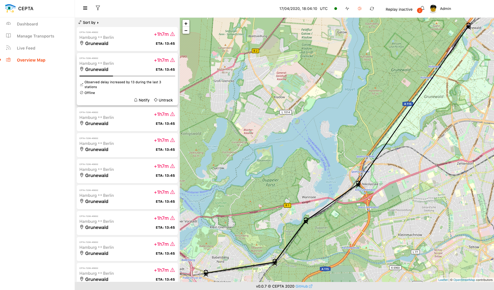

<p align="center">
  
</p>

CEPTA - Complex Event Processing Transportation Analysis

[](https://travis-ci.com/bptlab/cepta)

[](https://github.com/bptlab/cepta/releases/latest)

The open-source *CEPTA* project aims to examine the applicability of
modern (complex) event processing 
techniques in the context of intermodal transportation.
The project is under active development and will regularly 
push updates to the [demo instance](https://bpt-lab.org/cepta).

For more information, see [bptlab.github.io/cepta/](https://bptlab.github.io/cepta/).



#### Building
To build all executables of the entire project:
```bash
bazel build //:cepta
```
To build only a specific module or executable:
```bash
bazel build //auxiliary/producers/replayer  # Example
```

#### Running
To run a specific executable:
```bash
bazel run //auxiliary/producers/replayer -- --port 8080  # Example
```
To run mutiple specific executables (prevents locking) use run.sh instead of bazel run:
```bash
./run.sh //auxiliary/producers/replayer -- --port 8080  # Example
```


#### Testing
```bash
bazel test :all
bazel test //core:core-tests  # Only test core
``` 

#### Deployment
The project uses `docker` and `docker-compose` for deployment.
For instructions see `docs/deployment/dev.md` or `docs/deployment/prod.md` respectively.

Summary: To run the latest version, run 
```bash
CEPTA_VERSION="v0.3.0" docker-compose -f deployment/prod/docker-compose.yml up
```
